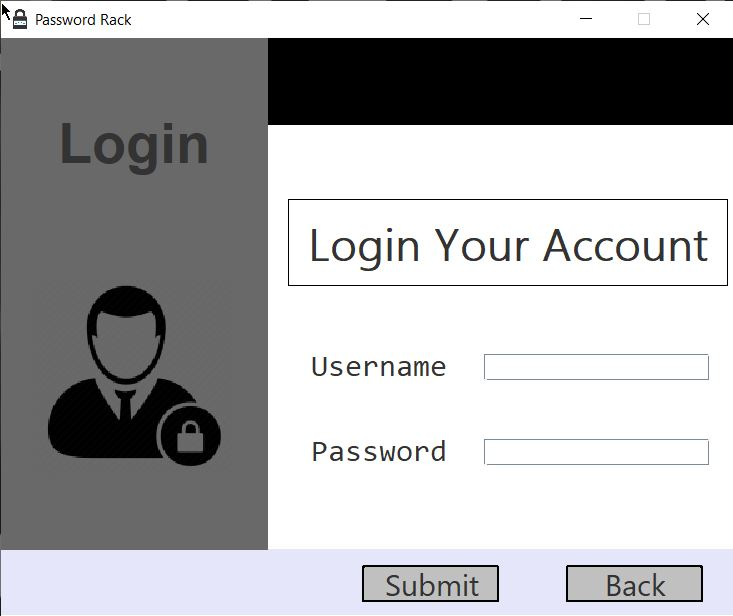
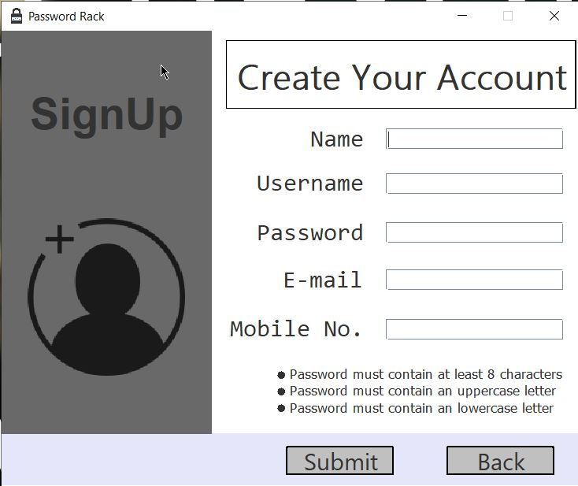
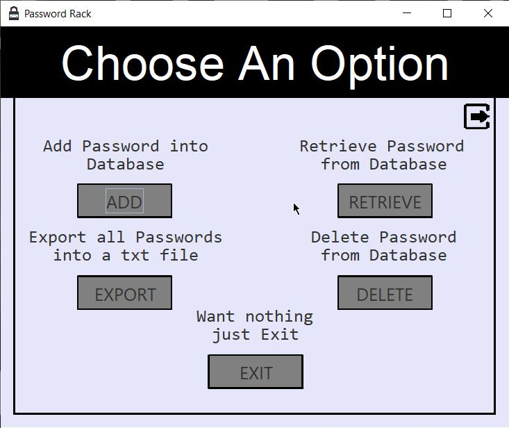

This not the complete build, it is only the source code of this project.

In order to run this application first download its executable file

Download the whole v1.00 folder :
Link - https://github.com/CryptoSingh1337/password-rack-allversion

Before Launching this application, First read the following Instructions.

Description
==========
Password Rack is designed in Java Swing and coded in Java using JDK-11.0.7.

It is basically a password storing application which stores your multiple passwords and provide you
a single password to manage those stored passwords. It stores all of your passwords into the Oracle
Database i.e. in Oracle 10g which you have to install on your system. This application can store
multiple passwords one by one into Database. The main key is the USERNAME which must be unique
for all user. On the basis of username it ADD, RETRIEVE, EXPORT, DELETE your passwords.

Password-Rack Features
=====================

* Export password file by taking the name of the file by user.
* Password-Rack works on local database which is hosted on the Localhost of the system i.e. 127.0.0.1
* Password-Rack ensures that user passwords are secured as it is on local server not on a remote server.
* Password-Rack can store data more than 1000 records.
* Very easy to use.

System Requirements
====================

* Password-Rack works with Windows 10, Windows 8.1/8, Windows 7
* Requires min JRE - 1.4.0
* Requires Oracle 10g(with username - system and password - manager) with ojdbc14.jar drivers 

Using Password-Rack
==================

* Running first time

1. Install Oracle 10g with ojdbc14.jar drivers. (Link - https://www.mediafire.com/folder/8e66ddjigj6zm/)
Username and Password must be 'system' and 'manager' respectively.

2. Add path of the ojdbc.jar file.
(Goto control panel -> system -> Advance system settings -> Environment Variables -> System Variables -> Path ->
New -> Add path of the jar file where it located).

3. After installing Oracle 10g -> Click on start menu and search Run SQL command Line.

4. then in SQL command line type "conn system/manager" - excluding inverted commas (conn username/password).

5. Run this query "create table PasswordRackAccounts (Name VARCHAR(100) NOT NULL, Username VARCHA
(100) NOT NULL, Password VARCHAR(100) NOT NULL, Email VARCHAR(100) NOT NULL, MobileNo VARCHAR2(10) NOT NULL, Primary key (Username));"  -exclding inverted commas
-----This query will create a table named PasswordRackAccounts which saves all the data about the user's account.

6. Then Run this query "create table PasswordRackUserData (Username VARCHAR(100) NOT NULL, Password_tag VARCHAR(100) NOT NULL, Password VARCHAR(100) NOT NULL);"
 -execluding inverted commas
-----This query will create a table named PasswordRackUserData which saves all the passwords with the Password tag and username associated with that password.

7. That all , Now you can successfully stores your password into Database. 

ScreenShots
==========

=================================

=================================

=================================

